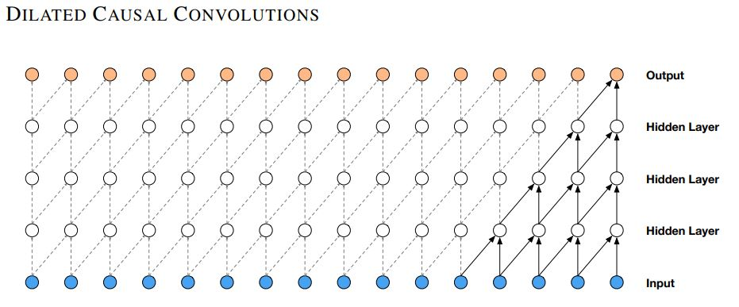
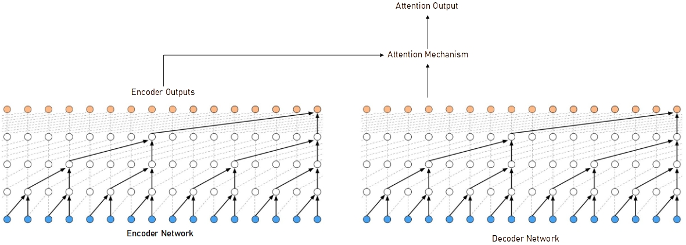

# NLP Language Modelling using Dilated Causal Convolutional Networks 
This repository includes the codes that was explored for language modelling using a 1D Dilated Causal Convolutional Networks. It is inspired from the [WaveNet Model](https://deepmind.com/blog/article/wavenet-generative-model-raw-audio), which was modified and applied to the Language Modelling task here. By applying dilated causal convolutional networks (CNN), the model increases the receptive field exponentially to allow it to model long range dependencies and sequences. The first layer has a dilation rate of 1, but subsequent layers have a dilation rate of 2. 

This repository includes a code to train the data on the [Reddit Jokes](https://github.com/taivop/joke-dataset) dataset. To train the model, first process the Reddit data by running
```
python process_reddit_jokes.py
```
if word tokens are used, or
```
python process_reddit_jokes_subword.py
```
if sub-word tokens are used. After processing the data, run
```
python reddit_jokes_seq_cnn_train.py
```
to train the model. The CNN structure allows training to be optimized on a GPU. To perform inference, the model runs auto-regressively on the seed input, or the current output sequence. To perform inference, run the code
```
python reddit_jokes_seq_cnn_test.py
```
Instead of using temperature, `tf.random.categorical` function is applied on the logits directly to introduce diversity in the inferred joke. Depending on the output sequence length, the inference can take some time. In the processing, the score assigned to the joke is categorized into 3 classes - bad, ok and good - to study its effect on the quality of the jokes generated.

## Dilated Convolutional Networks
The dilated convolutional neural network applied in the [WaveNet](https://arxiv.org/pdf/1609.03499.pdf) paper allows it to cover thousands of timesteps, making it suitable to generate synthetic utterances. Unlike the [Convolutional Sequence to Sequence Learning](https://arxiv.org/pdf/1705.03122.pdf) paper, no position embedding is applied in this implementation.



Fig 1.: WaveNet's Dilated Convolutional Network (source: [WaveNet](https://arxiv.org/pdf/1609.03499.pdf))

## Outputs
A model with 256 filters, 4 layers, 2 stacks and a convolution width (`kernel_size`) of 3 on Reddit jokes with a maximum of 30 word tokens was trained on an Nvidia Quadro P1000 4GB Graphics Card for 20000 iterations. Some of the model's output are provided in this section.
```
Input Phrase:
bad_joke
Generated Phrase:
bad_joke what do you call a hugh fish boat in a hairs ? a business . EOS

Input Phrase:
ok_joke
Generated Phrase:
ok_joke what do you get when you cross a joke with a rhetorical question ? ... EOS

Input Phrase:
good_joke
Generated Phrase:
good_joke " master yoda , are we on the right track ?" " off course , we are ." EOS
```
Overall, it was observed that the Sequence-CNN model is able to model much longer sequences, but its performance would not be as good as the GPT model if the hidden size of both models were the same.

## Sequence CNN Models with Attention

An extention to the Sequence CNN model is explored to incorporate attention. In this case, it is first observed that the different layers correspond to sequence outputs whose receptive fields are of different lengths. Hence, inspired by the [Compressive Transformer](https://arxiv.org/abs/1911.05507), the attention mechanism is done across the outputs of the different stacks/layers, allowing the model to combine outputs across different lengths. As the total number of stacks/layers is generally much lower than the sequence length, this operation is gentler on the hardware memory while maintaining an acceptable degree of performance.

The Sequence CNN module is stored in `tf_ver2_seq_cnn_attn.py` and run the command
```
python reddit_jokes_seq_cnn_attn_train.py
```
to train the the Sequence CNN Attention Model. As the model parameters of Sequence CNN and Sequence CNN Attention are similar, just changing the import modules would allow the `reddit_jokes_seq_cnn_test.py` inference to run using the intended model.

## Extension to Sequence-to-Sequence Models
Inspired by [Convolutional Sequence to Sequence Learning](https://arxiv.org/pdf/1705.03122.pdf) paper, a much simplified Sequence-to-Sequence CNN model using dilated causal convolution is developed here. Unlike Transformers, the attention mechanism is only applied once at the final layer of the Encoder and Decoder outputs. It is conceptually simple and bears some resemblance to RNN/LSTM networks. Similar to the implementation of sequence dilated causal convolutional neural networks, no positional embedding is applied in this implementation.



Fig 2.: Sequence-to-Sequence Architecture using Dilated Convolutional Network (Diagram modified from [WaveNet](https://arxiv.org/pdf/1609.03499.pdf) paper)

The Sequence-to-Sequence Dilated Convolutional Network is applied on the movie dialogue dataset. To process the data, run
```
python process_movie_dialogue.py
```
followed by
```
python dialogue_seq2seq_cnn_train.py
```
to train the model. To perform inference, run
```
python dialogue_seq2seq_cnn_test.py
```
with the input phrase of your choice.
